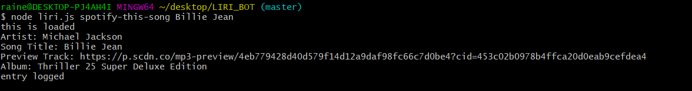

# LIRI_Bot

## Technologies Used:

JavaScript
Node.js
moment.js

LIRI-Bot stands for Language interpretation and Recognition interface. This Liri bot accepts four different commands:

- movie-this
- concert-this
- spotify-this-song
- do-what-it-says

movie-this leverages the OMDB API to pull data about a movie that you enter in. The following data returns per the API call:
- Movie Title
- Year
- IMDB Rating
- Rotten Tomatoes Rating
- Country it was made
- Plot of the movie
- Actors that star in the film

## Result of movie-this 

If nothing is entered into the field when calling "movie-this" you will get the above data for the film "Mr.Nobody" by default.

## Result when nothing is added

concert-this leverages the bandsintown API to pull data in about the next concert that the band you request is playing. The following data returns per the API call:
- Venue the concert is taking place
- Location of the concert
- Date of the concert
- Date/Time of the concert

## Result of concert-this

For Date/Time I leverage moment.js to properly format the date in an aethetically pleasing format.

spotify-this-song leverages the spotify API.  Enter a song that you like and the below data will appear:
- Artist Name
- Song Name
- Link to Preview Track
- Album Name

## Result of spotify-this-song

If nothing is entered in when calling  "spotify-this-song" the song "I Want it that Way" is requested by default with all the above information.

## Result of spotify-this-song left blank

do-what-it-says also leverages the spotify API but when entered the data in the "random.txt" file is read and than called via the spotify API.

## Random.txt file:

## Result from do-what-it-says

Lastely all data that is requested is appended to the "log.txt" as evidence my abilities with the appendfile function.